# City Publicity Posters · Xinjiang

**[中文](README.md)**

A collection of AI prompts and generated publicity posters for 42 cities and counties in Xinjiang, China — themed for 2026.

## Overview

This project features **Guochao (Chinese-style)** city publicity posters tailored for 42 cities and counties in the Xinjiang Uyghur Autonomous Region. Each city includes:

- **`prompt.md`** — AI image generation prompt, compatible with Gpt image 2.
- **`city_name.png`** — Generated 9:16 vertical publicity poster

## Design Language

All posters share a cohesive visual style:

- **Double exposure** — Figures blended with cityscapes
- **S-curve flowing composition** — Ribbons dance and transform into iconic landscapes
- **Guochao hand-painted scroll** — City landmarks and natural scenery woven in
- **Ethnic costumes** — Traditional attire of Uyghur, Kazakh, Hui, Mongol and other ethnic groups
- **Generous white space** — Ethereal, airy, and elegant
- **City-specific palettes** — Each city has its own unique color scheme

## Directory Structure

```text
city-publicity/
├── .github/                    # Contact QR codes
│   ├── redbook.jpg             # Xiaohongshu (Little Red Book)
│   └── wechat.jpg              # WeChat
└── 新疆/
    ├── 乌鲁木齐/
    │   ├── prompt.md           # AI prompt
    │   ├── 乌鲁木齐-1.png      # Generated poster
    │   └── 乌鲁木齐-2.png
    ├── 喀什/
    │   ├── prompt.md
    │   └── 喀什.png
    └── ...
```

## Covered Cities (42)

| Category | Cities |
| ------- | ------- |
| Prefecture-level Cities | Urumqi, Karamay, Turpan, Hami, Kashgar, Aksu, Hotan, Tacheng, Bole, Changji, Yining, Korla, Kuitun, Wusu, Shihezi, Altay, Artux |
| County-level Cities / Counties | Fukang, Kuqa, Qitai, Xinyuan, Tekes, Zhaosu, Huocheng, Ruoqiang, Bohu, Luntai, Yuli, Xayar, Wensu, Hejing, Barkol, Burqin, Fuyun, Tashkurgan |
| Direct-administered County-level Cities | Alar, Tumxuk, Wujiaqu, Beitun, Kokdala, Alashankou, Khorgos |

## Poster Gallery

> Click any poster to view its AI prompt

### Northern Xinjiang

> Snow mountains, grasslands, lakes — the grandeur of Northern Xinjiang

<table align="center">
  <tr>
    <td align="center">
      <a href="新疆/阿勒泰/prompt.md">
        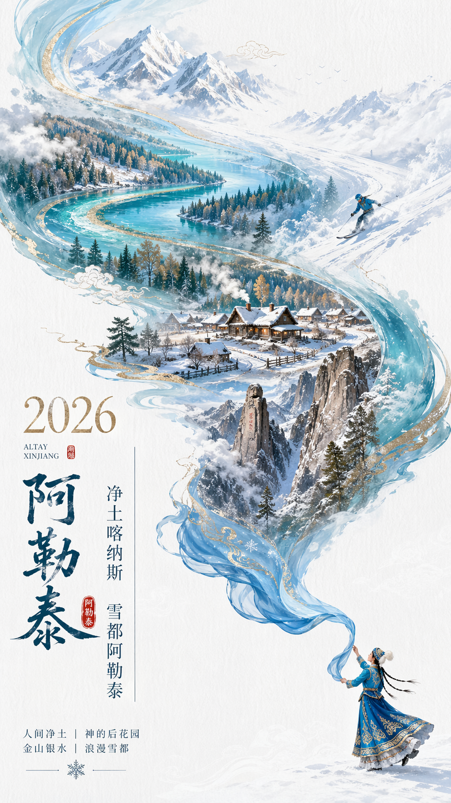
      </a>
      <br/>
      <a href="新疆/阿勒泰/prompt.md"><b>Altay</b></a><br/>
      <sub>净土喀纳斯，雪都阿勒泰</sub>
    </td>
    <td align="center">
      <a href="新疆/伊宁/prompt.md">
        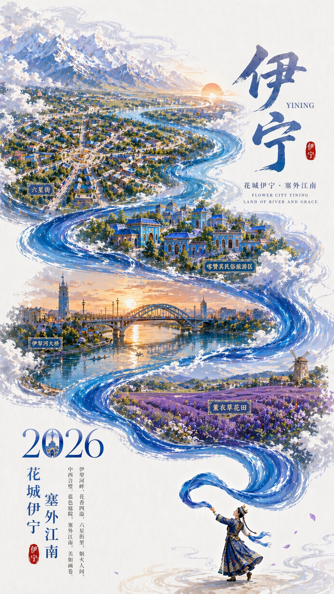
      </a>
      <br/>
      <a href="新疆/伊宁/prompt.md"><b>Yining</b></a><br/>
      <sub>花城伊宁，塞外江南</sub>
    </td>
    <td align="center">
      <a href="新疆/克拉玛依/prompt.md">
        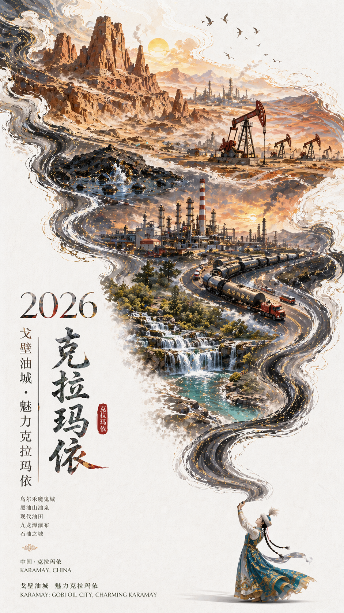
      </a>
      <br/>
      <a href="新疆/克拉玛依/prompt.md"><b>Karamay</b></a><br/>
      <sub>戈壁油城，魅力克拉玛依</sub>
    </td>
    <td align="center">
      <a href="新疆/塔城/prompt.md">
        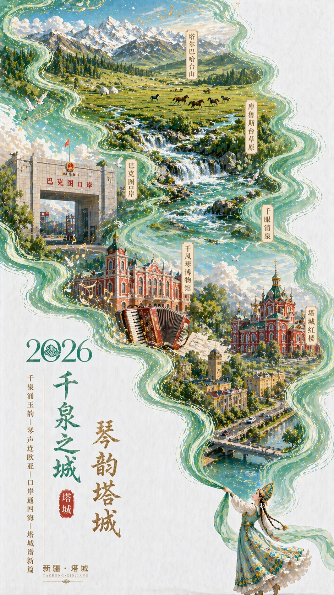
      </a>
      <br/>
      <a href="新疆/塔城/prompt.md"><b>Tacheng</b></a><br/>
      <sub>千泉之城，琴韵塔城</sub>
    </td>
  </tr>
  <tr>
    <td align="center">
      <a href="新疆/博乐/prompt.md">
        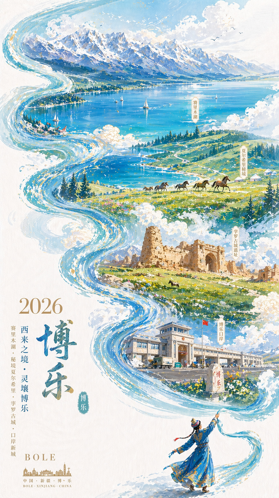
      </a>
      <br/>
      <a href="新疆/博乐/prompt.md"><b>Bole</b></a><br/>
      <sub>西来之境，灵壤博乐</sub>
    </td>
    <td align="center">
      <a href="新疆/布尔津县/prompt.md">
        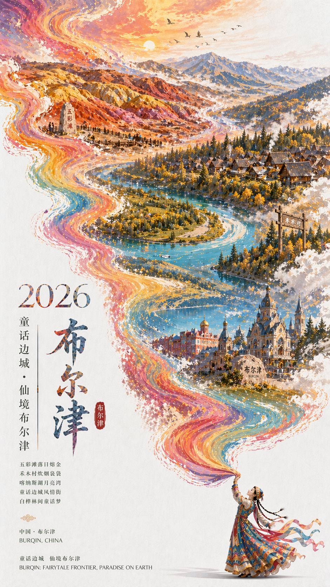
      </a>
      <br/>
      <a href="新疆/布尔津县/prompt.md"><b>Burqin</b></a><br/>
      <sub>童话边城，仙境布尔津</sub>
    </td>
    <td align="center">
      <a href="新疆/富蕴县/prompt.md">
        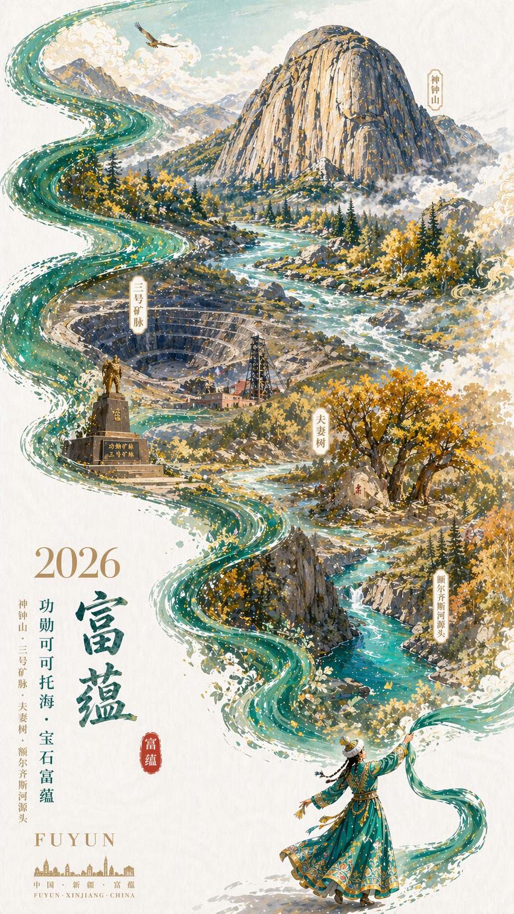
      </a>
      <br/>
      <a href="新疆/富蕴县/prompt.md"><b>Fuyun</b></a><br/>
      <sub>功勋可可托海，宝石富蕴</sub>
    </td>
    <td align="center">
      <a href="新疆/新源县/prompt.md">
        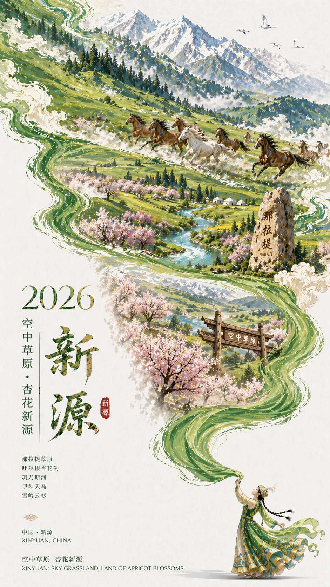
      </a>
      <br/>
      <a href="新疆/新源县/prompt.md"><b>Xinyuan</b></a><br/>
      <sub>空中草原，杏花新源</sub>
    </td>
  </tr>
  <tr>
    <td align="center">
      <a href="新疆/昭苏县/prompt.md">
        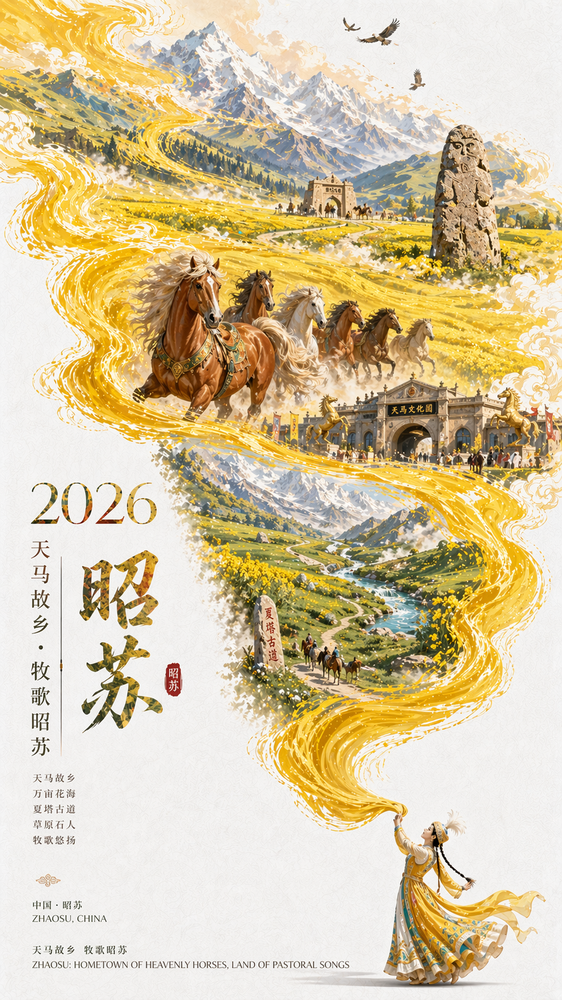
      </a>
      <br/>
      <a href="新疆/昭苏县/prompt.md"><b>Zhaosu</b></a><br/>
      <sub>天马故乡，牧歌昭苏</sub>
    </td>
    <td align="center">
      <a href="新疆/特克斯县/prompt.md">
        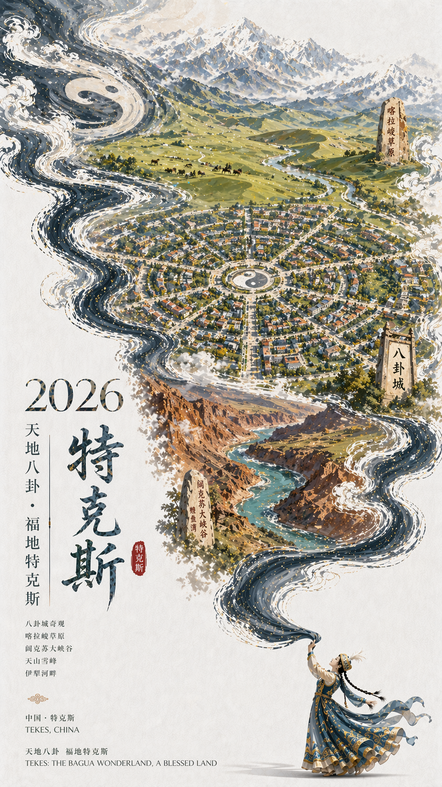
      </a>
      <br/>
      <a href="新疆/特克斯县/prompt.md"><b>Tekes</b></a><br/>
      <sub>天地八卦，福地特克斯</sub>
    </td>
    <td align="center">
      <a href="新疆/霍城县/prompt.md">
        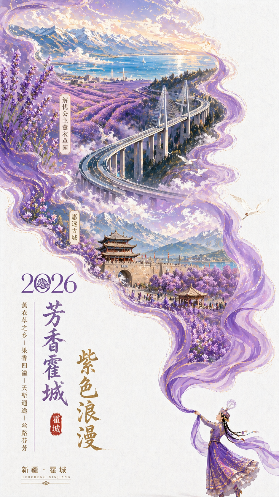
      </a>
      <br/>
      <a href="新疆/霍城县/prompt.md"><b>Huocheng</b></a><br/>
      <sub>芳香霍城，紫色浪漫</sub>
    </td>
    <td align="center">
      <a href="新疆/和静县/prompt.md">
        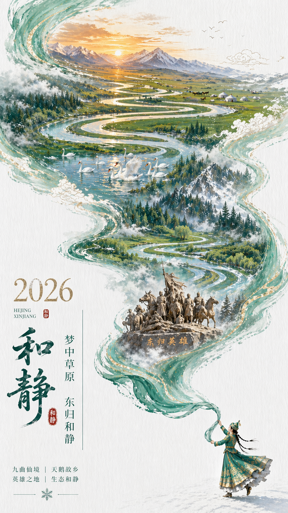
      </a>
      <br/>
      <a href="新疆/和静县/prompt.md"><b>Hejing</b></a><br/>
      <sub>梦中草原，东归和静</sub>
    </td>
  </tr>
</table>

### Capital & Tianshan North

> Silk Road hub, military reclamation cities

<table align="center">
  <tr>
    <td align="center">
      <a href="新疆/乌鲁木齐/prompt.md">
        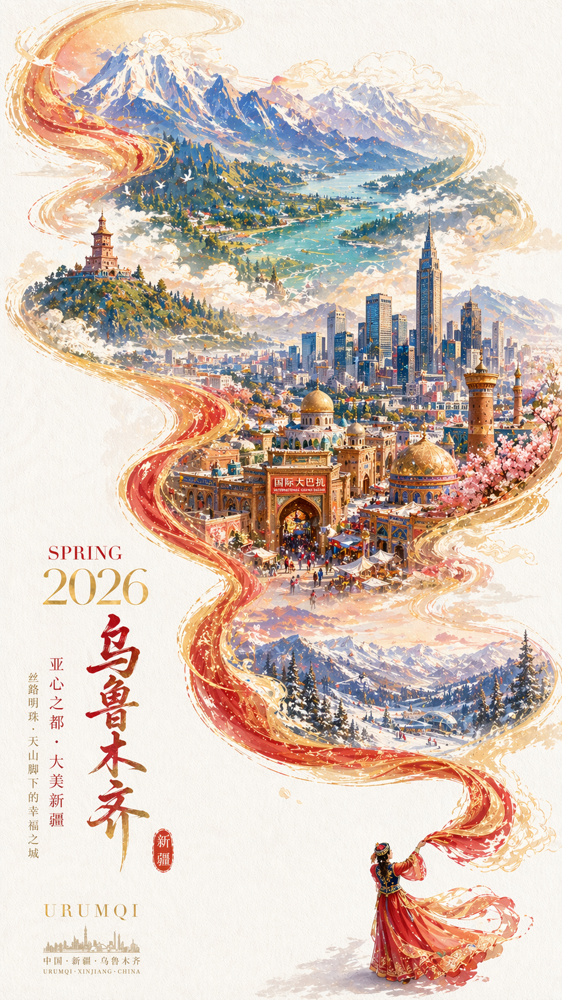
      </a>
      <br/>
      <a href="新疆/乌鲁木齐/prompt.md"><b>Urumqi</b></a><br/>
      <sub>亚心之都，大美新疆</sub>
    </td>
    <td align="center">
      <a href="新疆/昌吉/prompt.md">
        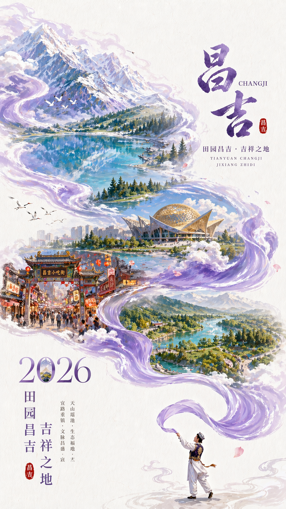
      </a>
      <br/>
      <a href="新疆/昌吉/prompt.md"><b>Changji</b></a><br/>
      <sub>田园昌吉，吉祥之地</sub>
    </td>
    <td align="center">
      <a href="新疆/石河子/prompt.md">
        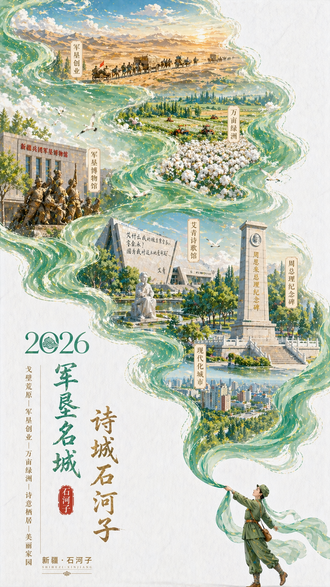
      </a>
      <br/>
      <a href="新疆/石河子/prompt.md"><b>Shihezi</b></a><br/>
      <sub>军垦名城，诗城石河子</sub>
    </td>
    <td align="center">
      <a href="新疆/奎屯/prompt.md">
        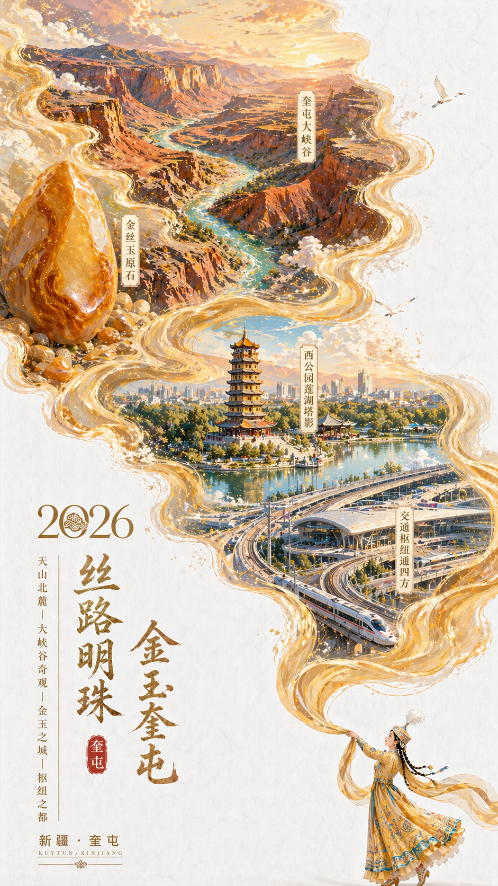
      </a>
      <br/>
      <a href="新疆/奎屯/prompt.md"><b>Kuitun</b></a><br/>
      <sub>丝路明珠，金玉奎屯</sub>
    </td>
  </tr>
  <tr>
    <td align="center">
      <a href="新疆/乌苏/prompt.md">
        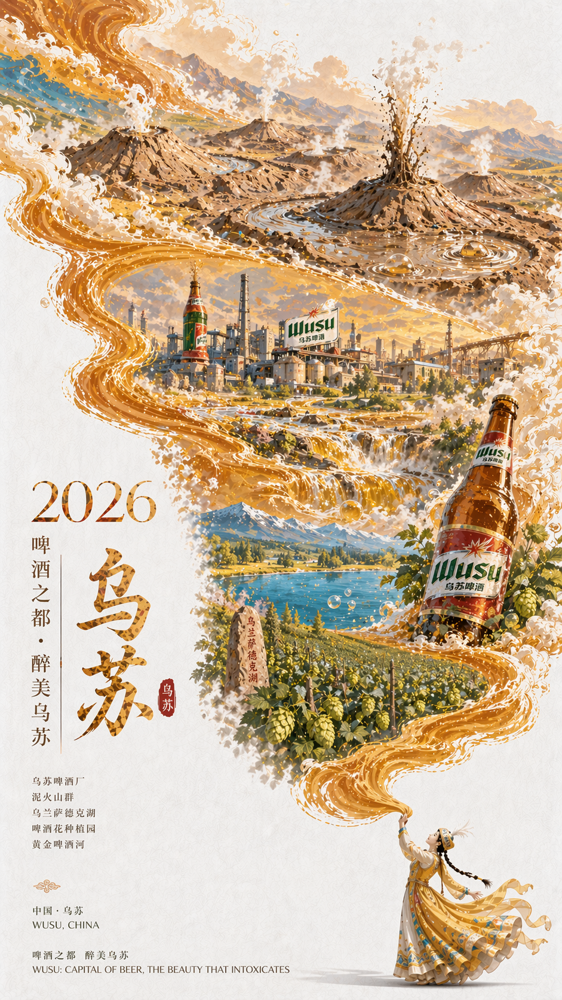
      </a>
      <br/>
      <a href="新疆/乌苏/prompt.md"><b>Wusu</b></a><br/>
      <sub>啤酒之都，醉美乌苏</sub>
    </td>
    <td align="center">
      <a href="新疆/阜康/prompt.md">
        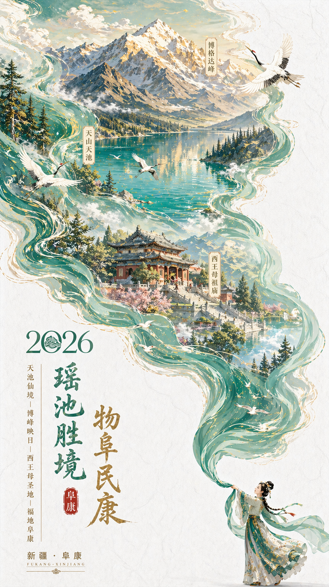
      </a>
      <br/>
      <a href="新疆/阜康/prompt.md"><b>Fukang</b></a><br/>
      <sub>瑶池胜境，物阜民康</sub>
    </td>
    <td align="center">
      <a href="新疆/奇台/prompt.md">
        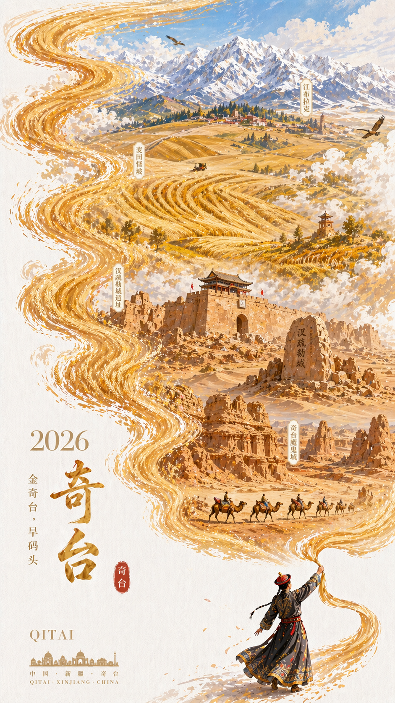
      </a>
      <br/>
      <a href="新疆/奇台/prompt.md"><b>Qitai</b></a><br/>
      <sub>金奇台，旱码头</sub>
    </td>
    <td align="center">
      <a href="新疆/五家渠市/prompt.md">
        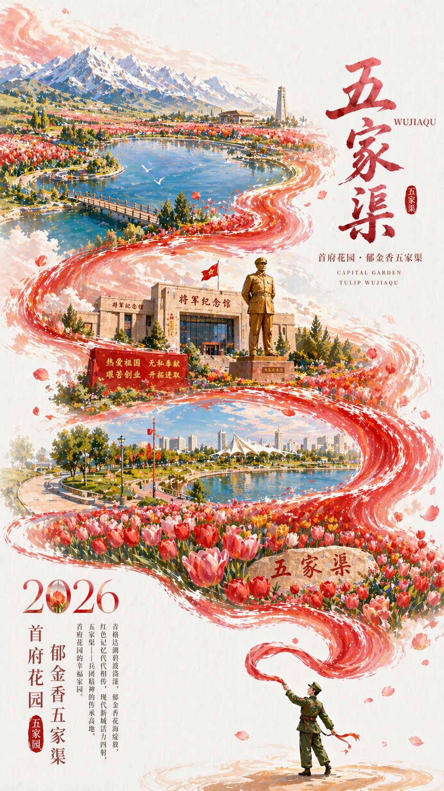
      </a>
      <br/>
      <a href="新疆/五家渠市/prompt.md"><b>Wujiaqu</b></a><br/>
      <sub>首府花园，郁金香五家渠</sub>
    </td>
  </tr>
  <tr>
    <td align="center">
      <a href="新疆/北屯市/prompt.md">
        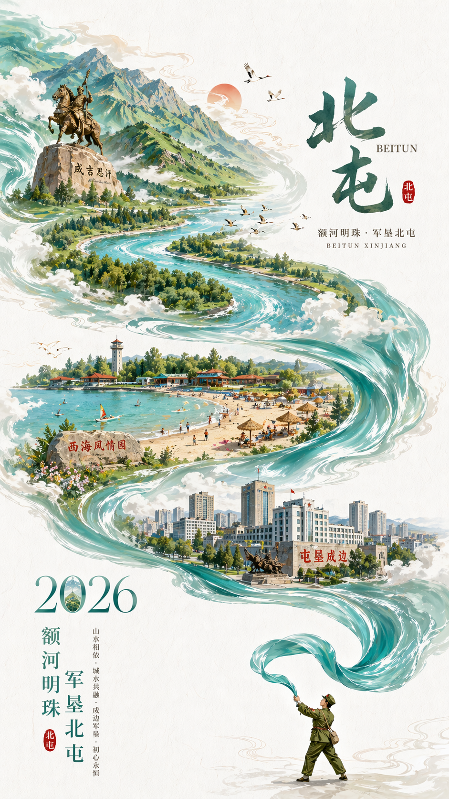
      </a>
      <br/>
      <a href="新疆/北屯市/prompt.md"><b>Beitun</b></a><br/>
      <sub>额河明珠，军垦北屯</sub>
    </td>
    <td align="center">
      <a href="新疆/可克达拉市/prompt.md">
        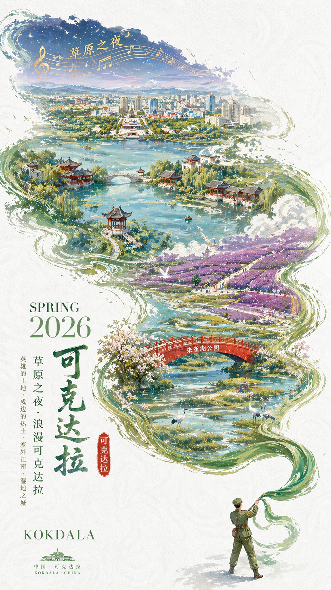
      </a>
      <br/>
      <a href="新疆/可克达拉市/prompt.md"><b>Kokdala</b></a><br/>
      <sub>草原之夜，浪漫可克达拉</sub>
    </td>
    <td align="center">
      <a href="新疆/阿拉山口市/prompt.md">
        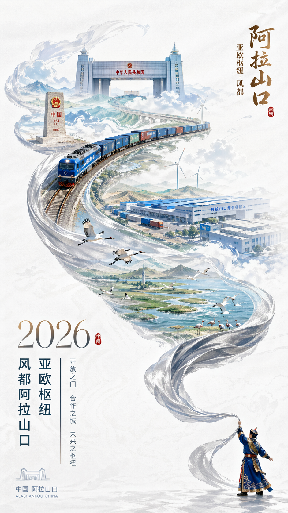
      </a>
      <br/>
      <a href="新疆/阿拉山口市/prompt.md"><b>Alashankou</b></a><br/>
      <sub>亚欧枢纽，风都阿拉山口</sub>
    </td>
    <td align="center">
      <a href="新疆/霍尔果斯市/prompt.md">
        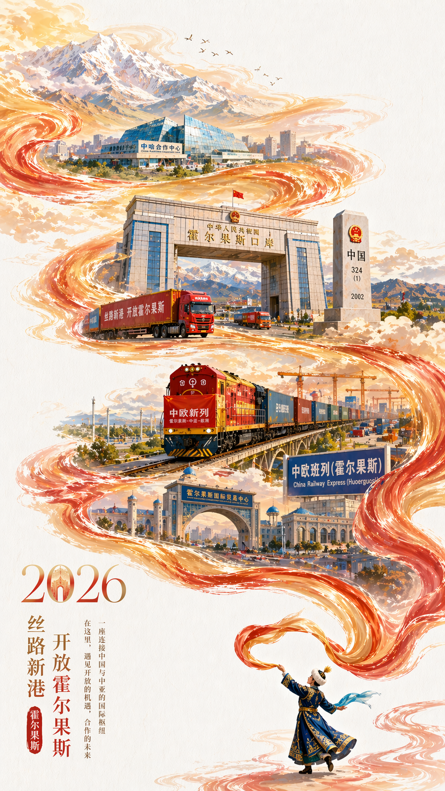
      </a>
      <br/>
      <a href="新疆/霍尔果斯市/prompt.md"><b>Khorgos</b></a><br/>
      <sub>丝路新港，开放霍尔果斯</sub>
    </td>
  </tr>
</table>

### Eastern Xinjiang

> Beneath the Flaming Mountains, sweet oasis

<table align="center">
  <tr>
    <td align="center">
      <a href="新疆/吐鲁番/prompt.md">
        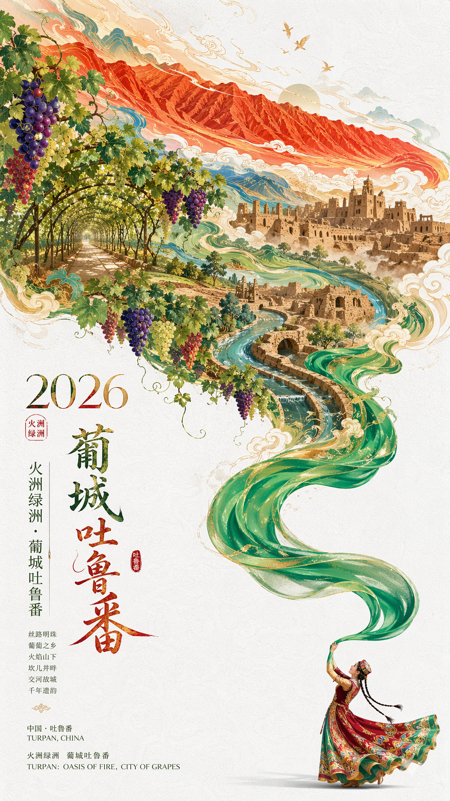
      </a>
      <br/>
      <a href="新疆/吐鲁番/prompt.md"><b>Turpan</b></a><br/>
      <sub>火洲绿洲，葡城吐鲁番</sub>
    </td>
    <td align="center">
      <a href="新疆/哈密/prompt.md">
        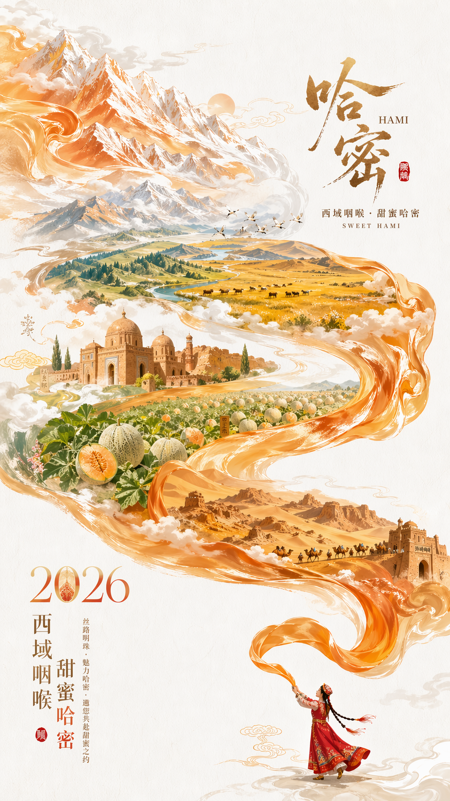
      </a>
      <br/>
      <a href="新疆/哈密/prompt.md"><b>Hami</b></a><br/>
      <sub>西域咽喉，甜蜜哈密</sub>
    </td>
    <td align="center">
      <a href="新疆/巴里坤哈萨克自治县/prompt.md">
        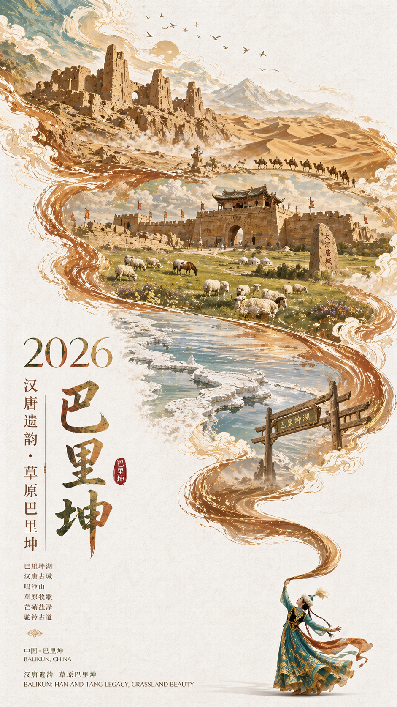
      </a>
      <br/>
      <a href="新疆/巴里坤哈萨克自治县/prompt.md"><b>Barkol</b></a><br/>
      <sub>汉唐遗韵，草原巴里坤</sub>
    </td>
    <td align="center">
      <a href="新疆/伊宁/prompt.md">
        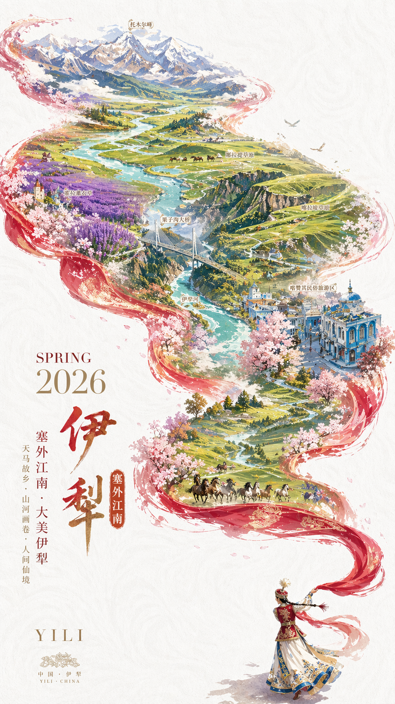
      </a>
      <br/>
      <a href="新疆/伊宁/prompt.md"><b>Yili</b></a><br/>
      <sub>塞外江南，天马故乡</sub>
    </td>
  </tr>
</table>

### Southern Xinjiang

> Ancient Kucha, poplar deserts

<table align="center">
  <tr>
    <td align="center">
      <a href="新疆/喀什/prompt.md">
        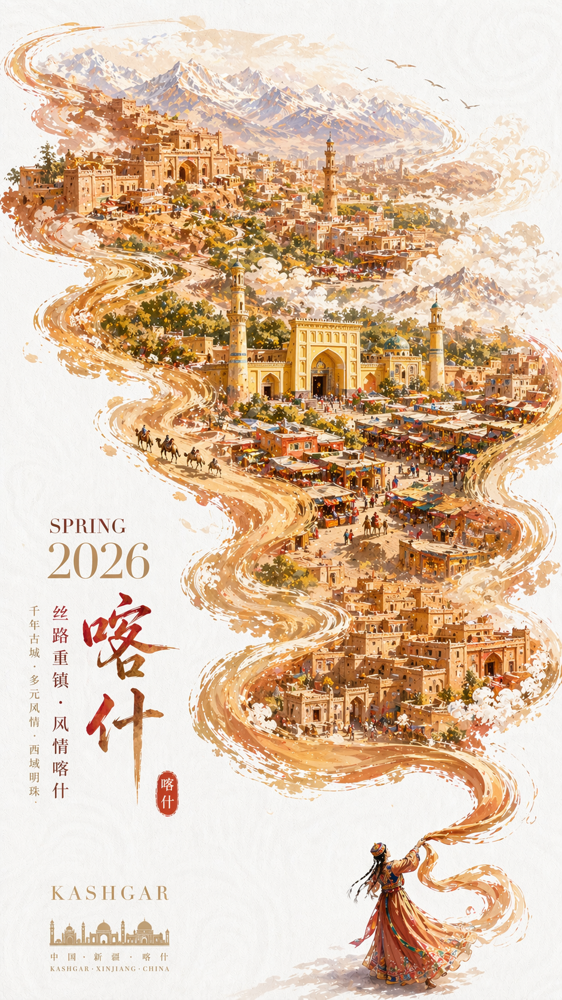
      </a>
      <br/>
      <a href="新疆/喀什/prompt.md"><b>Kashgar</b></a><br/>
      <sub>丝路重镇，风情喀什</sub>
    </td>
    <td align="center">
      <a href="新疆/阿克苏/prompt.md">
        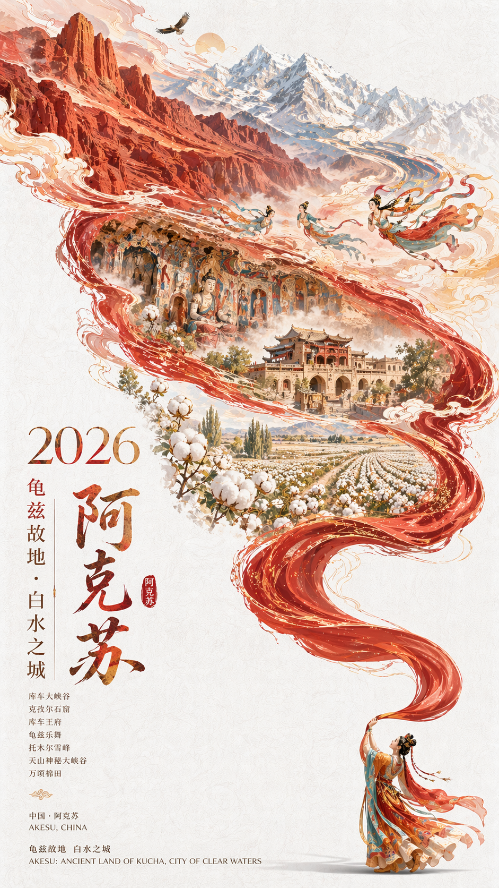
      </a>
      <br/>
      <a href="新疆/阿克苏/prompt.md"><b>Aksu</b></a><br/>
      <sub>龟兹故地，白水之城</sub>
    </td>
    <td align="center">
      <a href="新疆/库尔勒/prompt.md">
        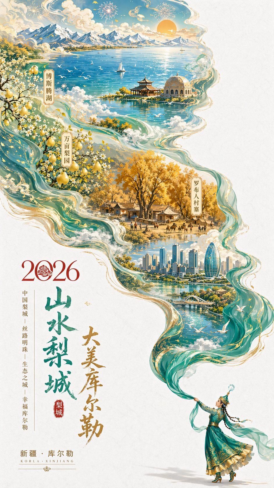
      </a>
      <br/>
      <a href="新疆/库尔勒/prompt.md"><b>Korla</b></a><br/>
      <sub>山水梨城，大美库尔勒</sub>
    </td>
    <td align="center">
      <a href="新疆/和田/prompt.md">
        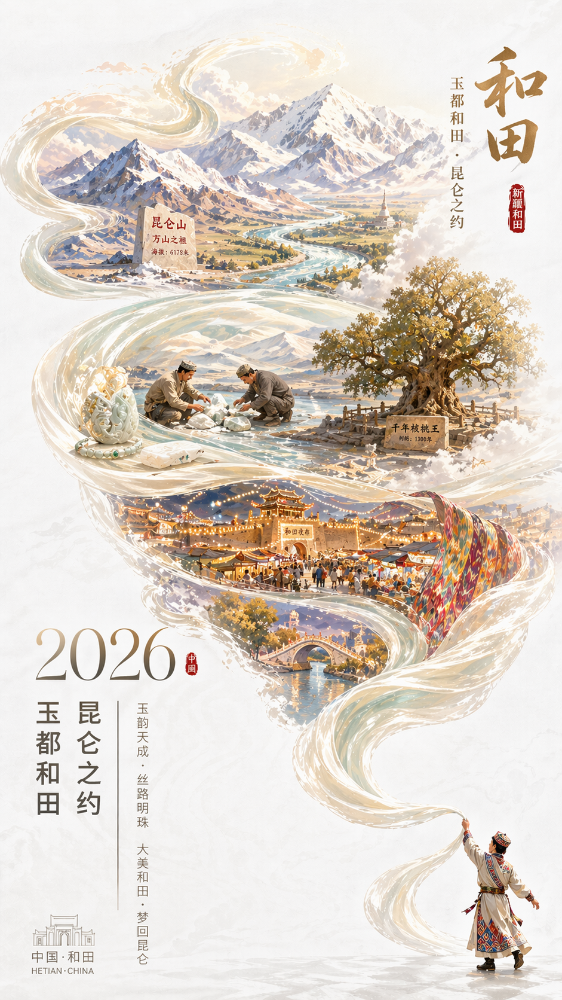
      </a>
      <br/>
      <a href="新疆/和田/prompt.md"><b>Hotan</b></a><br/>
      <sub>玉都和田，昆仑之约</sub>
    </td>
  </tr>
  <tr>
    <td align="center">
      <a href="新疆/库车/prompt.md">
        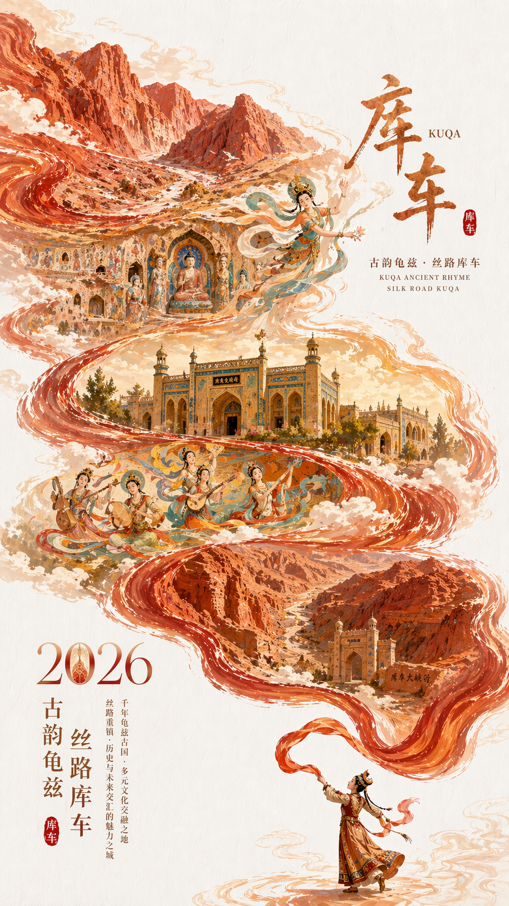
      </a>
      <br/>
      <a href="新疆/库车/prompt.md"><b>Kuqa</b></a><br/>
      <sub>古韵龟兹，丝路库车</sub>
    </td>
    <td align="center">
      <a href="新疆/阿图什/prompt.md">
        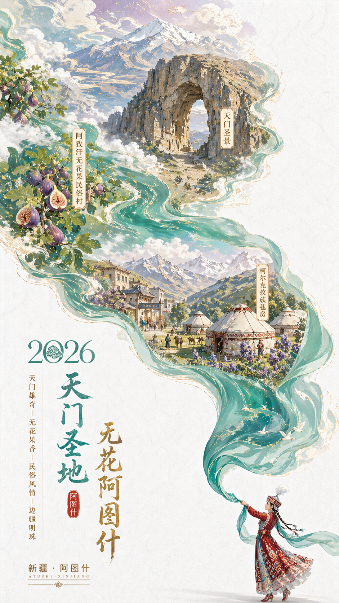
      </a>
      <br/>
      <a href="新疆/阿图什/prompt.md"><b>Artux</b></a><br/>
      <sub>天门圣地，无花阿图什</sub>
    </td>
    <td align="center">
      <a href="新疆/轮台县/prompt.md">
        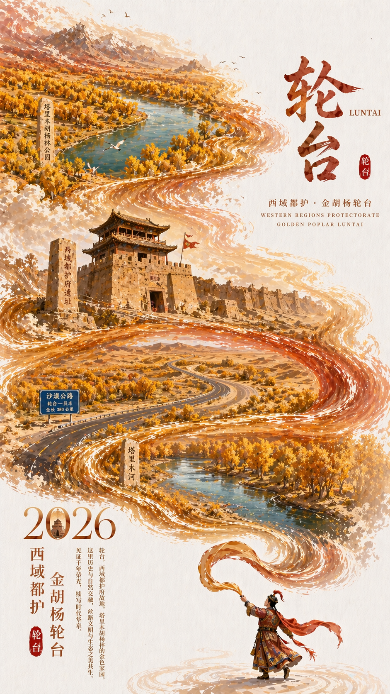
      </a>
      <br/>
      <a href="新疆/轮台县/prompt.md"><b>Luntai</b></a><br/>
      <sub>西域都护，金胡杨轮台</sub>
    </td>
    <td align="center">
      <a href="新疆/塔什库尔干/prompt.md">
        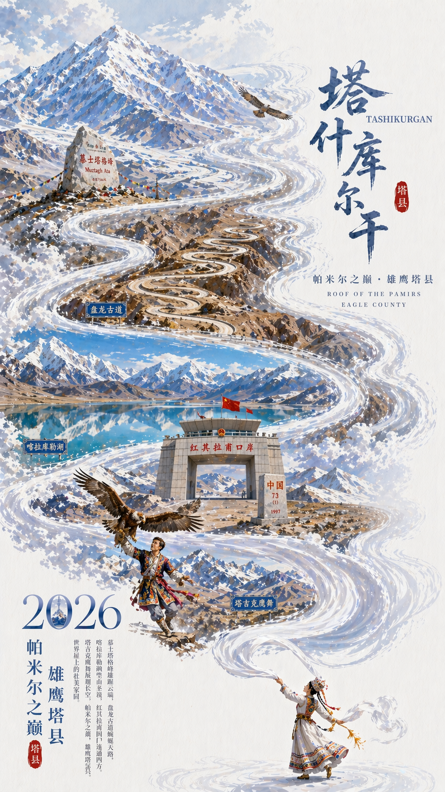
      </a>
      <br/>
      <a href="新疆/塔什库尔干/prompt.md"><b>Tashkurgan</b></a><br/>
      <sub>帕米尔之巅，雄鹰塔县</sub>
    </td>
  </tr>
  <tr>
    <td align="center">
      <a href="新疆/若羌县/prompt.md">
        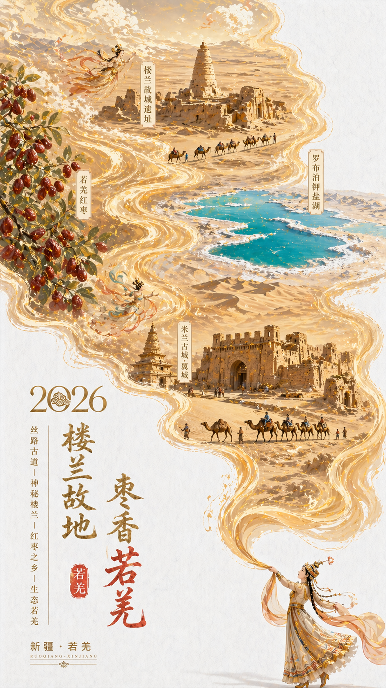
      </a>
      <br/>
      <a href="新疆/若羌县/prompt.md"><b>Ruoqiang</b></a><br/>
      <sub>楼兰故地，枣香若羌</sub>
    </td>
    <td align="center">
      <a href="新疆/尉犁县/prompt.md">
        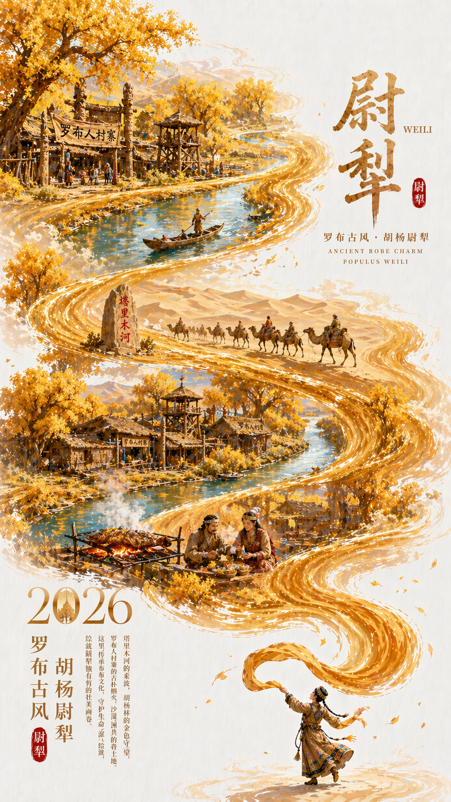
      </a>
      <br/>
      <a href="新疆/尉犁县/prompt.md"><b>Yuli</b></a><br/>
      <sub>罗布古风，胡杨尉犁</sub>
    </td>
    <td align="center">
      <a href="新疆/沙雅县/prompt.md">
        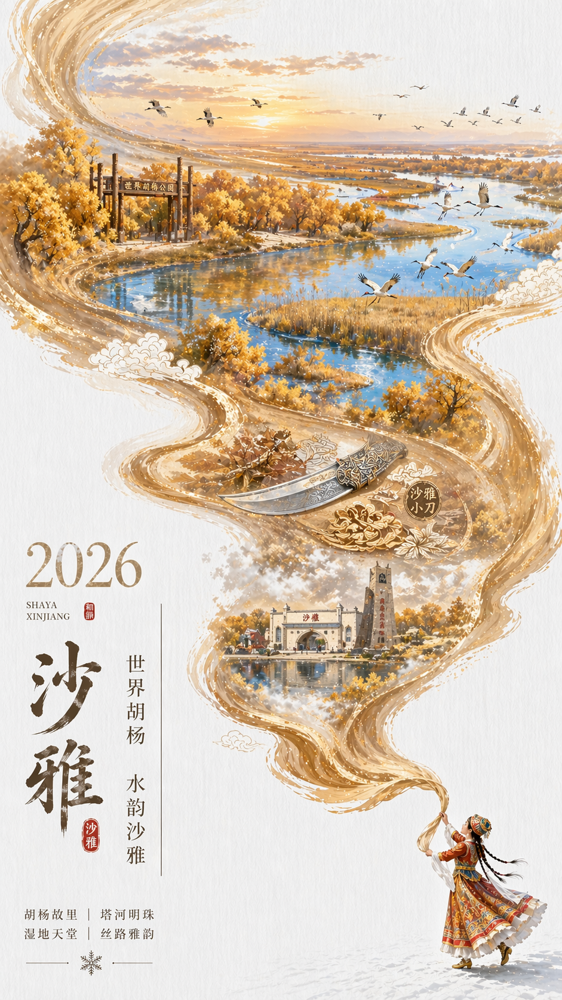
      </a>
      <br/>
      <a href="新疆/沙雅县/prompt.md"><b>Xayar</b></a><br/>
      <sub>世界胡杨，水韵沙雅</sub>
    </td>
    <td align="center">
      <a href="新疆/博湖县/prompt.md">
        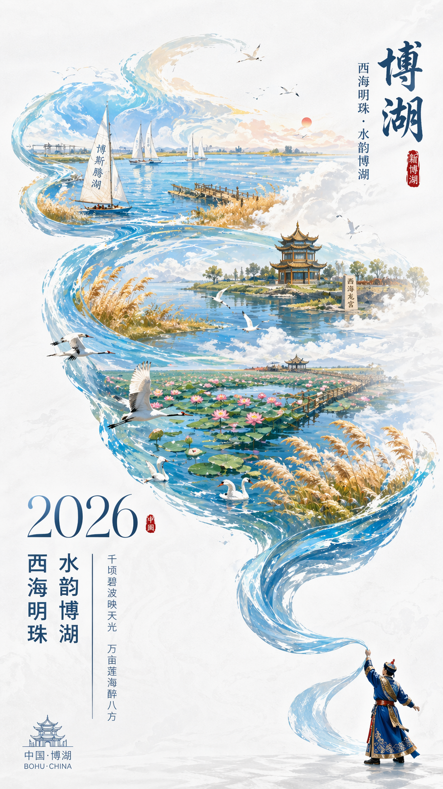
      </a>
      <br/>
      <a href="新疆/博湖县/prompt.md"><b>Bohu</b></a><br/>
      <sub>西海明珠，水韵博湖</sub>
    </td>
  </tr>
  <tr>
    <td align="center">
      <a href="新疆/温宿县/prompt.md">
        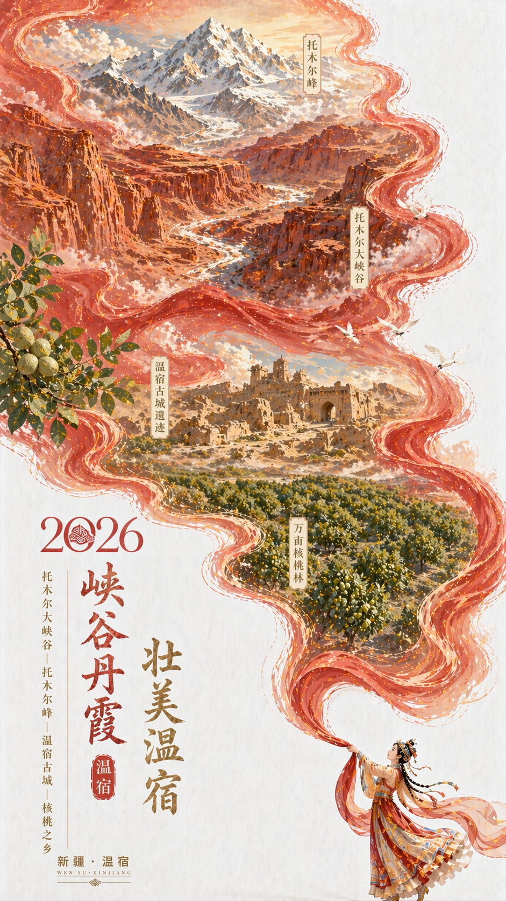
      </a>
      <br/>
      <a href="新疆/温宿县/prompt.md"><b>Wensu</b></a><br/>
      <sub>峡谷丹霞，壮美温宿</sub>
    </td>
    <td align="center">
      <a href="新疆/阿拉尔市/prompt.md">
        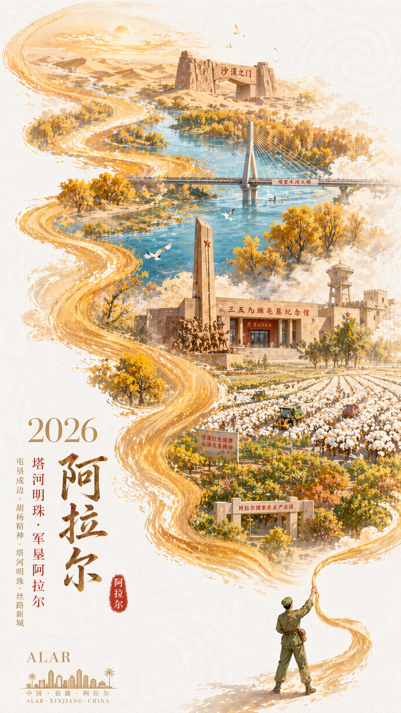
      </a>
      <br/>
      <a href="新疆/阿拉尔市/prompt.md"><b>Alar</b></a><br/>
      <sub>塔河明珠，军垦阿拉尔</sub>
    </td>
    <td align="center">
      <a href="新疆/图木舒克市/prompt.md">
        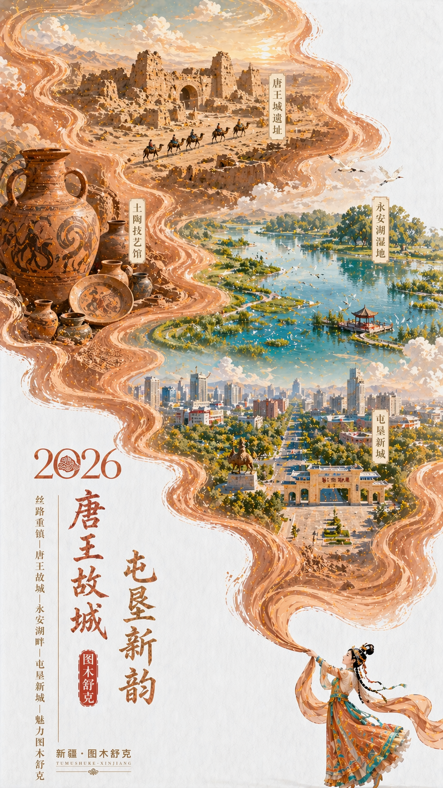
      </a>
      <br/>
      <a href="新疆/图木舒克市/prompt.md"><b>Tumxuk</b></a><br/>
      <sub>唐王故城，屯垦新韵</sub>
    </td>
    <td></td>
  </tr>
</table>

### Alternate Versions

> Some cities have multiple generated versions

<table align="center">
  <tr>
    <td align="center">
      <a href="新疆/乌鲁木齐/prompt.md">
        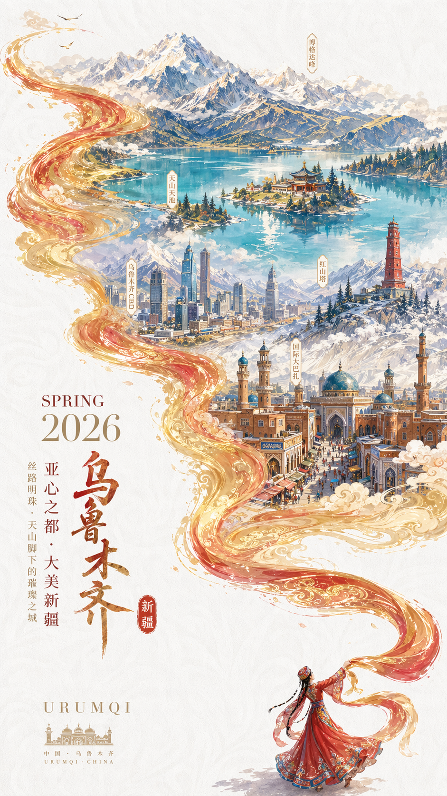
      </a>
      <br/>
      <a href="新疆/乌鲁木齐/prompt.md">Urumqi · v2</a>
    </td>
    <td align="center">
      <a href="新疆/乌鲁木齐/prompt.md">
        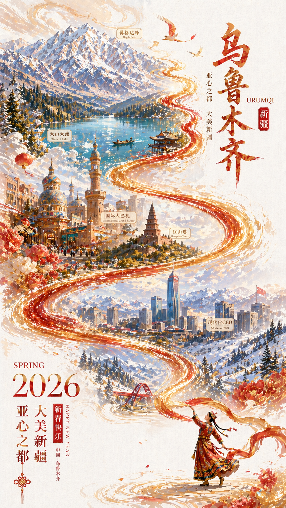
      </a>
      <br/>
      <a href="新疆/乌鲁木齐/prompt.md">Urumqi · v3</a>
    </td>
    <td align="center">
      <a href="新疆/喀什/prompt.md">
        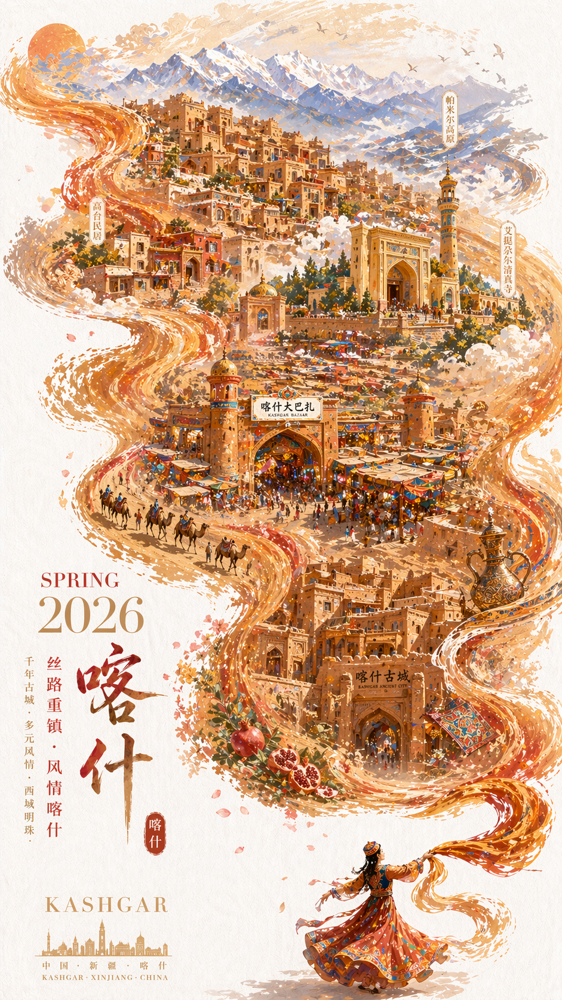
      </a>
      <br/>
      <a href="新疆/喀什/prompt.md">Kashgar · v2</a>
    </td>
    <td align="center">
      <a href="新疆/和田/prompt.md">
        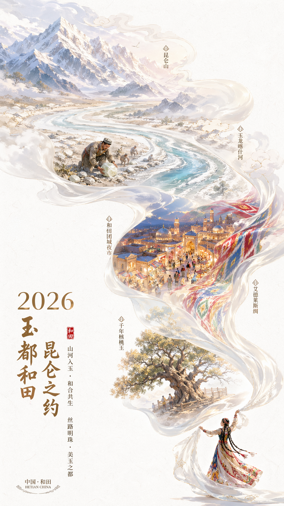
      </a>
      <br/>
      <a href="新疆/和田/prompt.md">Hotan · v2</a>
    </td>
  </tr>
  <tr>
    <td align="center">
      <a href="新疆/奇台/prompt.md">
        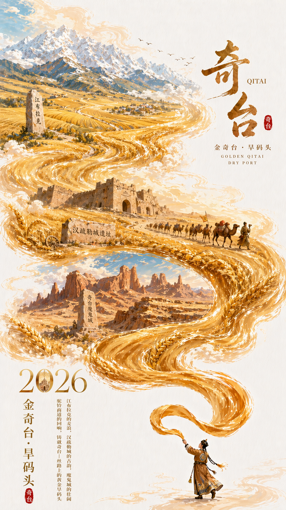
      </a>
      <br/>
      <a href="新疆/奇台/prompt.md">Qitai · v2</a>
    </td>
    <td align="center">
      <a href="新疆/阿拉山口市/prompt.md">
        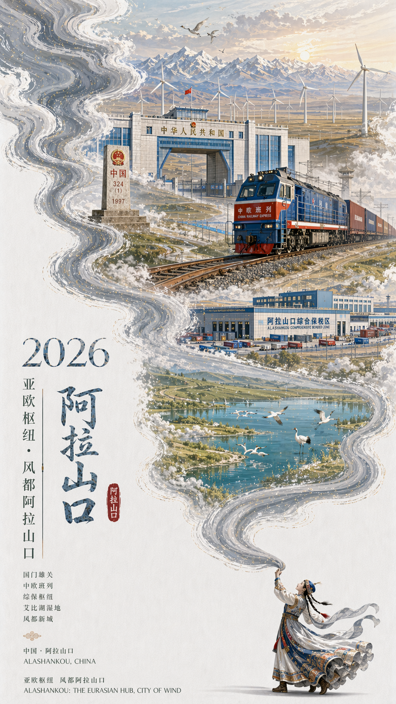
      </a>
      <br/>
      <a href="新疆/阿拉山口市/prompt.md">Alashankou · v2</a>
    </td>
    <td></td>
    <td></td>
  </tr>
</table>

## Usage

1. Navigate to a city directory and open `prompt.md` to get the prompt
2. Copy the prompt into an AI image generation tool (gpt image 2.)
3. Generate a 9:16 vertical poster
4. Tweak colors, landmarks, or other elements in the prompt as needed

## Contact

<p align="center">
  
  &nbsp;&nbsp;&nbsp;&nbsp;
  
</p>

<p align="center">
  Xiaohongshu &nbsp;&nbsp;&nbsp;&nbsp;&nbsp;&nbsp;&nbsp;&nbsp;&nbsp;&nbsp;&nbsp;&nbsp;&nbsp;&nbsp;&nbsp;&nbsp; WeChat
</p>

<p align="center">
  <a href="https://x.com/hashpandaxyz">X (Twitter)</a> ·
  <a href="https://x.com/funAgentApp">funAgent</a>
</p>

## Acknowledgements

Inspired by [@liyue_ai](https://x.com/liyue_ai)'s city poster creations

## Star History

<div align="center">

[](https://star-history.com/#funAgent/city-publicity&Date)

</div>
